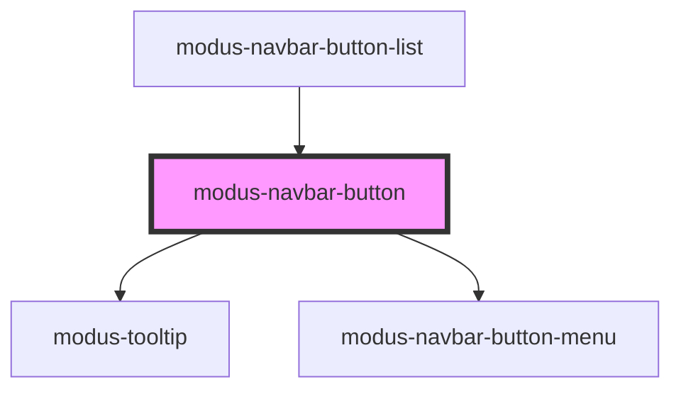

# modus-navbar-button

<!-- Auto Generated Below -->

## Properties

| Property   | Attribute   | Description                               | Type      | Default     |
| ---------- | ----------- | ----------------------------------------- | --------- | ----------- |
| `buttonId` | `button-id` | The id for the button in the Navbar.      | `string`  | `undefined` |
| `icon`     | `icon`      | The icon for the button in the Navbar.    | `string`  | `undefined` |
| `menu`     | `menu`      | The menu for the button in the Navbar.    | `string`  | `undefined` |
| `reverse`  | `reverse`   |                                           | `boolean` | `undefined` |
| `tooltip`  | `tooltip`   | The tooltip for the button in the Navbar. | `string`  | `undefined` |

## Dependencies

### Used by

 - [modus-navbar-button-list](../button-list)

### Depends on

- [modus-tooltip](../../modus-tooltip)
- [modus-navbar-button-menu](../button-menu)

### Graph

----------------------------------------------

